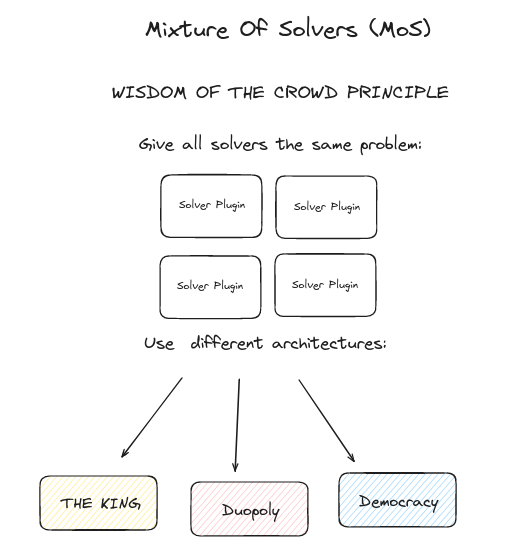
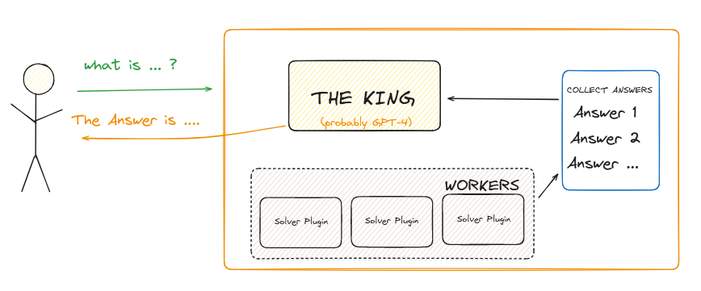
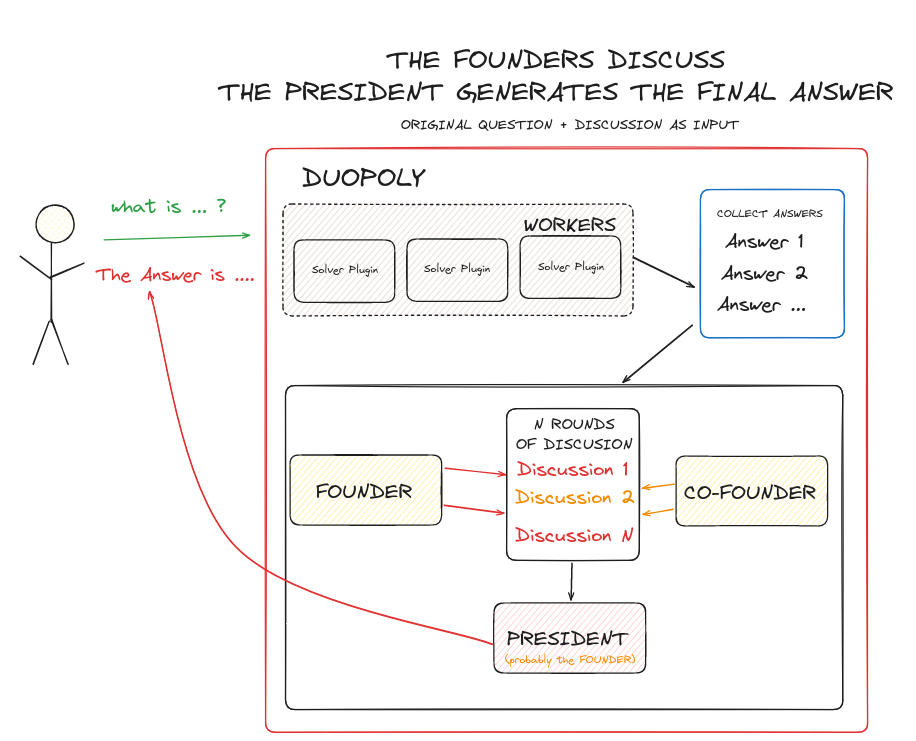
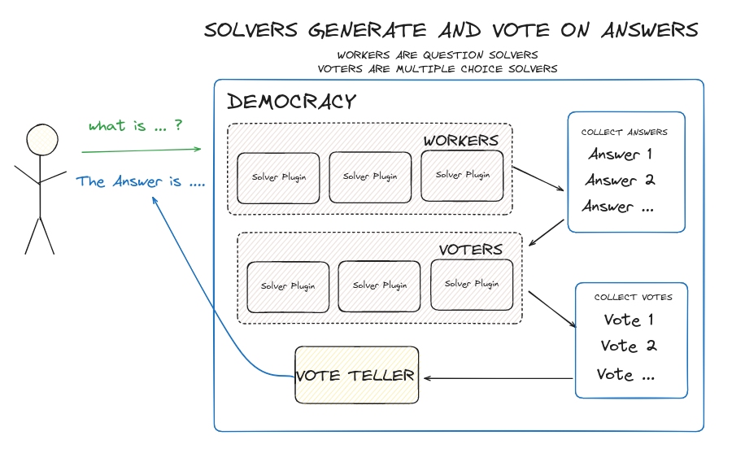

# MoS - Mixture Of Solvers

using OpenVoiceOS solver plugins we implement 3 strategies to combine solvers before deciding the final answer

A solver may be [a LLM](https://github.com/OpenVoiceOS/ovos-solver-plugin-openai-persona), a [HiveMind connection](https://jarbashivemind.github.io/HiveMind-community-docs), or [any other chatbot](https://openvoiceos.github.io/ovos-technical-manual/persona_server), documentation [here](https://openvoiceos.github.io/ovos-technical-manual/solvers)

