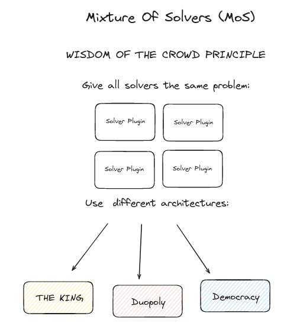
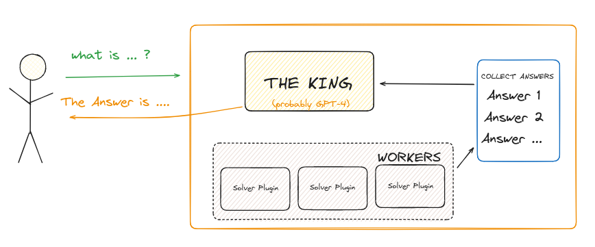
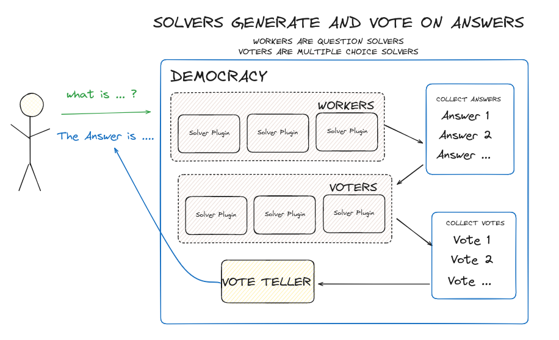
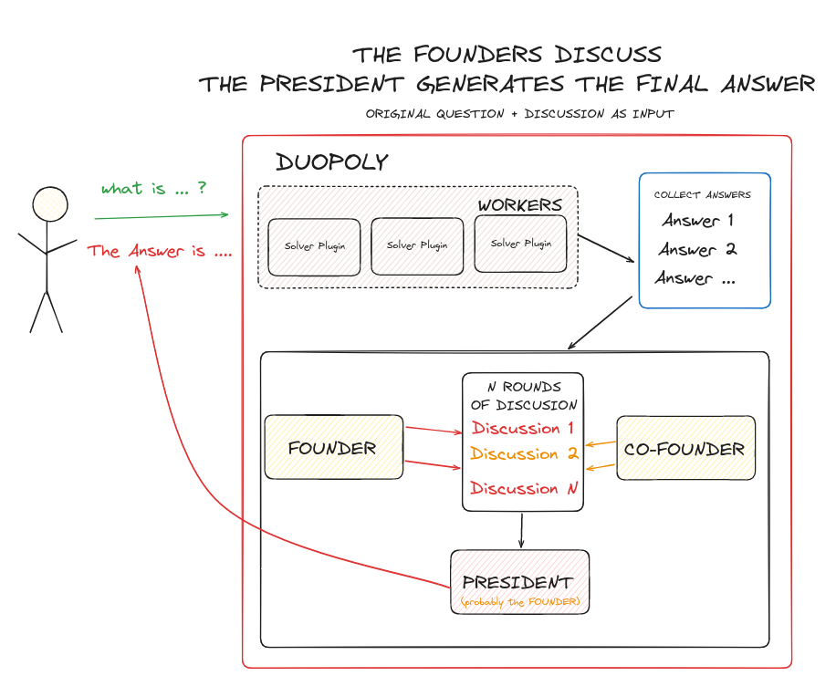

[](https://deepwiki.com/TigreGotico/ovos-MoS)

# MoS - Mixture Of Solvers

Using [OpenVoiceOS agent plugins](https://openvoiceos.github.io/ovos-technical-manual/solvers), we implement three
strategies to combine agents before deciding the final answer.

An agent may be [an LLM](https://github.com/OpenVoiceOS/ovos-solver-plugin-openai-persona),
a [HiveMind connection](https://github.com/JarbasHiveMind/ovos-solver-hivemind-plugin/),
or [any other chatbot](https://openvoiceos.github.io/ovos-technical-manual/persona_server).

Each MoS strategy is registered as an OPM `opm.agents.chat` plugin and can be loaded from config.



> NOTE: MoS can be used recursively. You can use a full MoS in place of any individual agent from this scheme, such as
> a Democracy of Kings or a Duopoly of Democracies.

## Modern API (ChatEngine-based)

The new API in `ovos_MoS.agents` uses `ChatEngine` / `ReRankerEngine` from OPM. Workers are queried concurrently via `ThreadPoolExecutor`.

### Direct instantiation

```python
from ovos_MoS.agents import KingMoSEngine, DemocracyMoSEngine, DuopolyMoSEngine

# King with a ReRankerEngine — selects best worker answer
engine = KingMoSEngine(king=my_reranker, workers=[chat1, chat2, chat3])
answer = engine.get_response("What is the speed of light?")

# King with a ChatEngine — generates a synthesis from worker answers
engine = KingMoSEngine(king=my_llm, workers=[chat1, chat2])
answer = engine.get_response("Explain quantum mechanics")

# Democracy — voters vote, optional president breaks ties
engine = DemocracyMoSEngine(voters=[rr1, rr2], workers=[chat1, chat2])
answer = engine.get_response("Who wrote Hamlet?")

# Duopoly — founders discuss, president decides
engine = DuopolyMoSEngine(
    president=my_reranker, founders=[llm1, llm2],
    config={"discussion_rounds": 3}
)
answer = engine.get_response("What caused the 2008 financial crisis?")
```

### Config-driven OPM plugins

Register via `opm.agents.chat` entry points. Load from config:

```json
{
    "module": "ovos-mos-king-reranker",
    "king": {"module": "ovos-reranker-bm25-plugin"},
    "workers": [
        {"module": "ovos-solver-plugin-ddg"},
        {"module": "ovos-solver-plugin-wikipedia"}
    ],
    "max_workers": 4,
    "worker_timeout": 30
}
```

Available entry points:
- `ovos-mos-king-reranker` — King with ReRanker selection
- `ovos-mos-king-generative` — King with generative synthesis
- `ovos-mos-democracy` — Democracy with voter ReRankers
- `ovos-mos-duopoly-reranker` — Duopoly with ReRanker president
- `ovos-mos-duopoly-generative` — Duopoly with generative president
- `ovos-mos-tournament` — Bracket-style elimination via ReRanker
- `ovos-mos-cascade` — Sequential querying with early stopping
- `ovos-mos-jury` — Weighted voting
- `ovos-mos-chain` — Sequential refinement pipeline
- `ovos-mos-committee` — Multi-round convergence

### Additional strategies

```python
from ovos_MoS.agents import (
    TournamentMoSEngine, CascadeMoSEngine, JuryMoSEngine,
    ChainMoSEngine, CommitteeMoSEngine,
)

# Tournament — bracket elimination, log(N) reranker calls
engine = TournamentMoSEngine(referee=my_reranker, workers=[c1, c2, c3, c4])

# Cascade — sequential with early stopping on confidence
engine = CascadeMoSEngine(
    scorer=my_reranker, workers=[cheap_solver, expensive_solver],
    config={"threshold": 0.8}
)

# Jury — weighted voting (e.g. weight by model quality)
engine = JuryMoSEngine(
    jurors=[rr1, rr2, rr3], juror_weights=[1.0, 2.0, 3.0],
    workers=[c1, c2]
)

# Chain — sequential refinement pipeline
engine = ChainMoSEngine(workers=[drafter, refiner, polisher])

# Committee — multi-round convergence
engine = CommitteeMoSEngine(
    workers=[llm1, llm2, llm3], president=my_reranker,
    config={"max_rounds": 3}
)
```

### Streaming

Engines with generative kings/presidents support real-time token streaming:

```python
for token in engine.stream_tokens(messages):
    print(token, end="", flush=True)
```

### Metrics

```python
from ovos_MoS.metrics import MoSMetrics

metrics = MoSMetrics()
with metrics.track_strategy("KingMoS"):
    with metrics.track_worker("KingMoS", "ddg"):
        answer = ddg.get_response(query)
print(metrics.report_text())
```

### Composition helpers

```python
from ovos_MoS.compose import democracy_of_kings, cascade_then_committee

# Democracy where each worker is a King MoS
engine = democracy_of_kings(
    king_configs=[
        {"king": rr1, "workers": [chat1, chat2]},
        {"king": rr2, "workers": [chat3, chat4]},
    ],
    voters=[voter1, voter2],
)
```

### Hyperparameter & architecture search

```python
from ovos_MoS.search import (
    CategoricalDim, FloatRangeDim, RandomSearch, GeneticSearch,
    default_mos_factory,
)

space = {
    "strategy": CategoricalDim(["king", "cascade", "jury"]),
    "workers": CategoricalDim([
        [{"module": "ovos-solver-plugin-ddg"}],
        [{"module": "ovos-solver-plugin-ddg"},
         {"module": "ovos-solver-plugin-wikipedia"}],
    ]),
    "king": CategoricalDim([{"module": "ovos-reranker-bm25-plugin"}]),
    "scorer": CategoricalDim([{"module": "ovos-reranker-bm25-plugin"}]),
    "threshold": FloatRangeDim(0.5, 1.0),
}

def evaluate(engine):
    return sum(len(engine.get_response(q)) > 0
               for q in test_queries) / len(test_queries)

# Quick random search
report = RandomSearch(space, default_mos_factory, evaluate, seed=42).run(50)

# Refine with genetic search
report = GeneticSearch(space, default_mos_factory, evaluate, seed=42).run(
    population_size=20, generations=30)

print(f"Best: {report.best.params['strategy']} — {report.best.score:.3f}")
```

#### MoS-as-judge: evolve MoS with MoS

```python
from ovos_MoS.search import make_mos_judge_evaluator, make_reranker_evaluator

# Use a ReRanker to evaluate answers against references
evaluator = make_reranker_evaluator(my_reranker, benchmark)

# Or use a high-quality MoS as the judge for other MoS configs
judge = KingMoSEngine(king=best_reranker, workers=[llm1, llm2])
evaluator = make_mos_judge_evaluator(judge, benchmark, scoring_reranker)

report = GeneticSearch(space, default_mos_factory, evaluator).run()
```

### Async support

```python
from ovos_MoS._async import gather_async, gather_sync_in_executor

# For native async workers
answers = await gather_async(workers, async_fn, query)

# For sync workers in async apps
answers = await gather_sync_in_executor(workers, sync_fn, query)
```

## Legacy API (deprecated)

The classes in `ovos_MoS.__init__` use the deprecated `QuestionSolver`/`MultipleChoiceSolver` hierarchy and will be removed in ovos-MoS 1.0.

## MoS Strategies

### The King



For the choice of final answer, typically a ReRanker is used, but a QuestionSolver can also be used for generative responses

`ReRankerKingMoS` uses a re-ranker to select the best answer from the intermediate responses provided by the worker
solvers.

```python
# Initialize solvers
workers = [QuestionSolver1(), QuestionSolver2(), QuestionSolver3()]
king = ReRankerSolver()

# Create a King MoS instance
mos = ReRankerKingMoS(king, workers)

# Get the answer to a query
query = "What is the speed of light?"
answer = mos.spoken_answer(query)
print(answer)
```

`GenerativeKingMoS` uses a LLM Solver as the king to generate the final answer based on the intermediate responses.

```python
# Initialize solvers
workers = [QuestionSolver1(), QuestionSolver2(), QuestionSolver3()]
cfg = {
    "model": "RichardErkhov/GritLM_-_GritLM-7B-gguf",
    "remote_filename": "*Q4_K_M.gguf",
    "n_gpu_layers": -1
}
king = GGUFSolver(cfg)

# Create a King MoS instance
mos = GenerativeKingMoS(king, workers)

# Get the answer to a query
query = "Explain quantum mechanics in simple terms"
answer = mos.spoken_answer(query)
print(answer)
```


### Democracy




`DemocracyMoS` introduces a set of "voter" solvers (rerankers) that vote on the intermediate answers provided by the
worker solvers.
The answer with the most votes is selected as the final answer.

```python
# Initialize solvers
workers = [QuestionSolver1(), QuestionSolver2(), QuestionSolver3()]
voters = [ReRankerSolver1(), ReRankerSolver2(), ReRankerSolver3()]

# Create a Democrcy MoS instance
mos = DemocracyMoS(voters, workers)

# Get the answer to a query
query = "Explain quantum mechanics in simple terms"
answer = mos.spoken_answer(query)
print(answer)
```

`ReRankerDemocracyMoS` voters are used to filter answers with 0 votes, a re-ranker is then used to select the best final answer.

```python
# Initialize solvers
workers = [QuestionSolver1(), QuestionSolver2(), QuestionSolver3()]
voters = [ReRankerSolver1(), ReRankerSolver2(), ReRankerSolver3()]
president = ReRankerSolver()

# Create a Democracy MoS instance
mos = ReRankerDemocracyMoS(president, voters, workers)

# Get the answer to a query
query = "Explain quantum mechanics in simple terms"
answer = mos.spoken_answer(query)
print(answer)
```

`GenerativeDemocracyMoS` replaces re-ranking with a LLM that generates the final answer.

```python
# Initialize solvers
workers = [QuestionSolver1(), QuestionSolver2(), QuestionSolver3()]
voters = [ReRankerSolver1(), ReRankerSolver2(), ReRankerSolver3()]
president = GGUFSolver({
    "model": "RichardErkhov/GritLM_-_GritLM-7B-gguf",
    "remote_filename": "*Q4_K_M.gguf",
    "n_gpu_layers": -1
})

# Create a Democracy MoS instance
mos = GenerativeDemocracyMoS(president, voters, workers)

# Get the answer to a query
query = "Explain quantum mechanics in simple terms"
answer = mos.spoken_answer(query)
print(answer)
```


### Duopoly



`ReRankerDuopolyMoS` introduces a pair of "founder" solvers that discuss and refine the intermediate answers provided by the
worker solvers.
A "president" solver (reranker) then selects the final answer based on this discussion.

```python
# Initialize solvers
founders = [QuestionSolver1(), QuestionSolver2()]
president = ReRankerSolver()

# Create a Duopoly MoS instance
mos = ReRankerDuopolyMoS(president, founders)

# Get the answer to a query
query = "Explain quantum mechanics in simple terms"
answer = mos.spoken_answer(query)
print(answer)
```


`GenerativeDuopolyMoS` uses LLMs as the founders to discuss and refine the intermediate answers before the president
generates the final answer.

```python
# Initialize solvers
founder = GGUFSolver({
    "model": "RichardErkhov/GritLM_-_GritLM-7B-gguf",
    "remote_filename": "*Q4_K_M.gguf",
    "n_gpu_layers": -1
})
cofounder = GGUFSolver({
    "model": "MaziyarPanahi/Mistral-7B-Instruct-v0.3-GGUF",
    "remote_filename": "*Q4_K_M.gguf"
})

founders = [founder, cofounder]
president = founder

# Create a Duopoly MoS instance
mos = GenerativeDuopolyMoS(president, founders)

# Get the answer to a query
query = "Explain quantum mechanics in simple terms"
answer = mos.spoken_answer(query)
print(answer)
```
